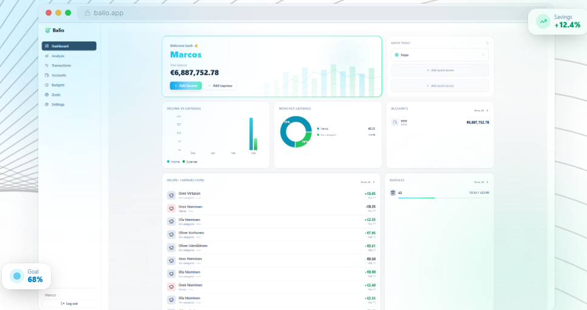
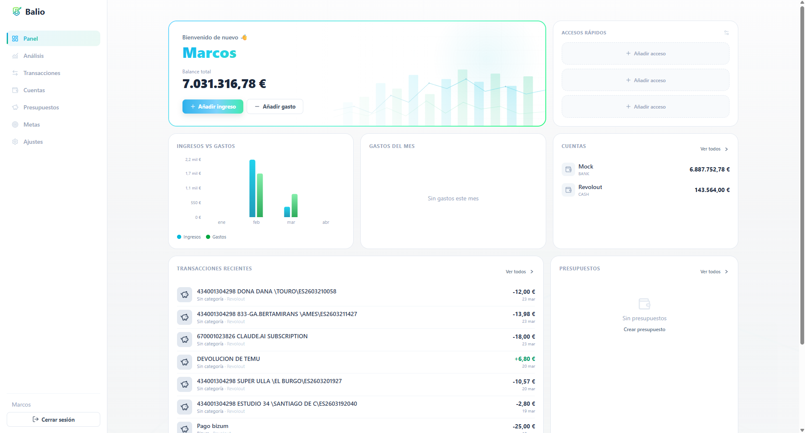
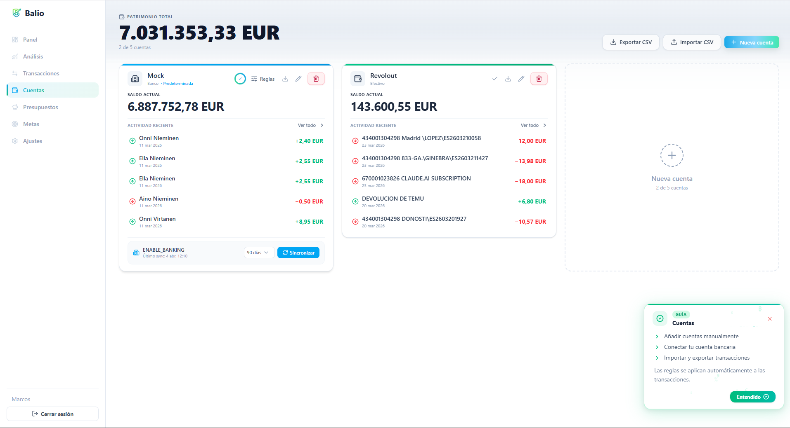
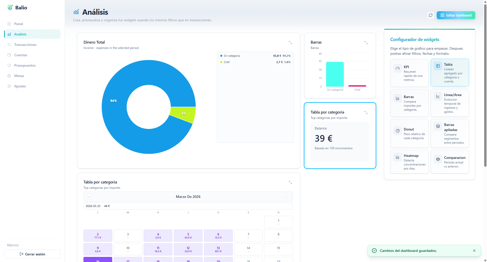
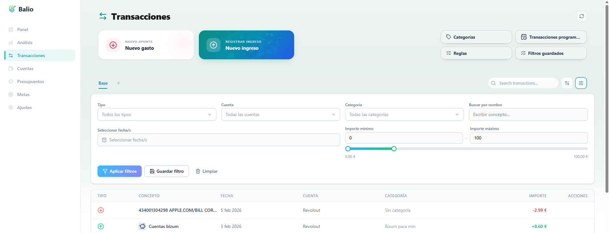
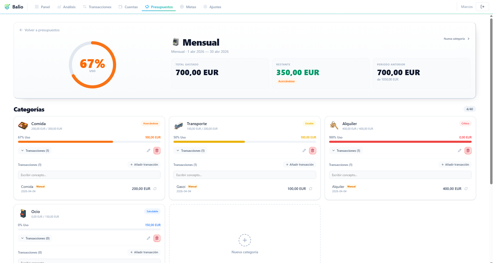
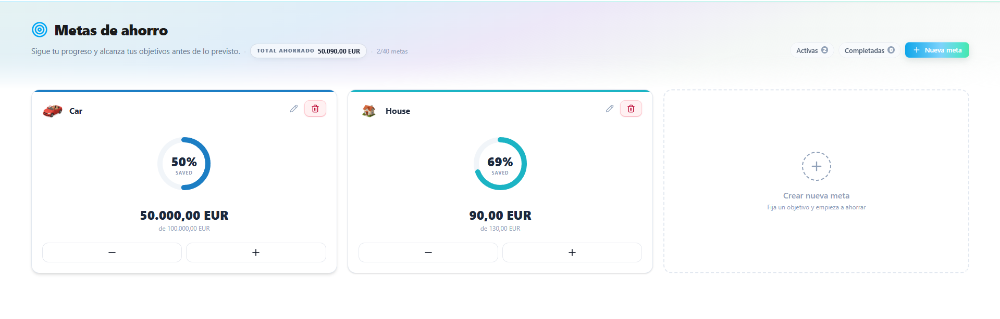

# Balio 💰

### Mock



Personal Finance Management Web App (Full-Stack)  
Final Degree Project (TFG)

---

## 🚀 Overview

Balio is a full-stack web application designed to help users manage their personal finances in a centralized and highly customizable way.

It provides a unified view of multiple bank accounts, enabling efficient financial control across different entities or even within a household.

The application emphasizes flexibility, allowing users to define their own categories and build personalized dashboards with dynamic charts and widgets.

Additionally, Balio supports multiple languages (Spanish, English, and Galician), making it accessible to a wider audience.

It allows tracking accounts, transactions, budgets, savings goals, and provides powerful analytics through a customizable dashboard.

This project is built both as a **real-world usable product** and as an **academic project**, focusing on clean architecture, security, and scalability.

---

## 🎬 Demo


---

## 📸 Screenshots

### Dashboard


### Accounts


### Analysis


### Transactions


### Budgets


### Goals


---

## ✨ Features

### 🔐 Authentication & Security
- JWT-based authentication
- Refresh token rotation
- Secure session handling

### 💳 Account Management
- Create, edit, delete accounts
- Manual and bank-linked accounts
- Balance adjustments

### 💸 Transactions
- Income & expense tracking
- Advanced filters
- Recurring transactions
- Bulk rules for normalization

### 🏷️ Categories
- Custom categories with icons and colors
- Search and pagination

### 🎯 Budgets & Goals
- Budget planning by period
- Savings goals with progress tracking

### 📊 Analytics Dashboard
- Widgets: bar, line, donut, KPI, tables
- Drag & resize grid layout
- Dynamic filters and metrics

### 🏦 Open Banking Integration
- Bank connection via OAuth (Enable Banking)
- Automatic synchronization
- Deduplication & mapping rules

---

## 🌍 Additional Features
- Internationalization (ES / EN / GL)
- CSV import/export
- Exchange rates (Frankfurter API)
- Swagger / OpenAPI documentation
- Scheduled cleanup tasks
- Environment validation
- Contextual UI guides

---

## 🧱 Tech Stack

### Backend
- Java 21
- Spring Boot
- Hibernate / JPA
- PostgreSQL
- Flyway
- JWT (jjwt)
- Caffeine Cache
- Swagger (Springdoc)

### Frontend
- React 19 + TypeScript
- Vite
- React Router
- Axios
- Recharts
- React Grid Layout
- Tailwind CSS
- GSAP

### Testing & Tooling
- JUnit + Spring Test
- Vitest + Testing Library
- Playwright (E2E)
- ESLint + Checkstyle
- JaCoCo (coverage)
- Docker Compose

---

## ⚙️ Getting Started

### 🐳 Option 1: Run with Docker (Recommended)

1. Start Docker Desktop  
2. Run:

```bash
docker-compose up -d
```

3. Start backend (folder backend):

```bash
mvn spring-boot:run 
```

### 💾 Option 2: H2 Profile (Memory DB)

Run backend with H2:

```bash
./mvnw -Ph2 spring-boot:run -Dspring-boot.run.profiles=h2
```

Run frontend (folder frontend):

```bash
npm start
```

## 📚 API Documentation

Swagger UI:

http://localhost:8080/swagger-ui/index.html

OpenAPI JSON:

http://localhost:8080/v3/api-docs


## 🧪 Testing & Coverage

Run full verification:

./mvnw verify

This executes:

Unit tests (Surefire)
Integration tests (Failsafe)
JaCoCo report

📊 Coverage report:

target/site/jacoco/index.html

⚠️ Minimum coverage enforced: 80%


## 🗄️ Database
PostgreSQL via Docker
Migrations handled with Flyway

Access DB manually:

docker exec -it balio-postgres psql -U balio -d balio

📌 Final Notes

Balio aims to combine daily financial tracking with advanced analytics, offering both manual control and automated bank synchronization.

It reflects best practices in:

Software architecture
Security
Testing
Developer experience